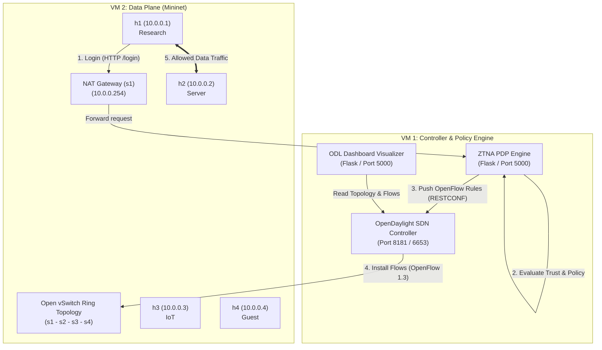

# Software-Defined Networking (SDN) & Zero Trust Network Access (ZTNA) Testbed

[](https://www.python.org/)
[](https://flask.palletsprojects.org/)
[](https://www.opendaylight.org/)
[](http://mininet.org/)

Repository ini berisi kumpulan *mini-projects* dan modul eksperimen **Software-Defined Networking (SDN)** dan **Zero Trust Network Access (ZTNA)**. Proyek ini mengintegrasikan pengontrol SDN **OpenDaylight (ODL)**, simulator jaringan **Mininet (Open vSwitch)**, *Policy Decision Point* (PDP) kustom, serta **Dashboard Visualizer Web** interaktif berbasis RESTCONF.

---

## 📌 Fitur Utama & Skenario Pengujian

Repository ini mendukung **2 Skenario Operasional**:

1. **Skenario 1: Visualisasi & Pengujian Topologi SDN Standar (`topologi/`)**
   - Menggunakan fitur `odl-l2switch-switch` bawaan OpenDaylight.
   - Otomatisasi pembentukan topologi *ring* 4-switch (`s1` – `s4`).
   - Mekanisme *warm-up* ARP untuk penemuan *host* secara otomatis pada dashboard.

2. **Skenario 2: ZTNA Architecture & Microsegmentation (`PEP/` & `PDP/`)**
   - Menjalankan arsitektur Zero Trust dengan model **Default-Drop** (*Microsegmentation*).
   - Modul PDP (*Policy Decision Point*) menghitung **Dynamic Trust Score** real-time berdasarkan *Identity*, *Context*, dan *Behavioral factors*.
   - Injeksi *flow entry* terarah (*shortest ring path*) secara langsung ke ODL Config Datastore via **RESTCONF API**.
   - Otomatisasi penanganan LLDP punt & PDP carveout flow agar tahan terhadap *resynchronization* OpenFlow.

3. **SDN Dashboard & Topology Visualizer (`visualizer/`)**
   - Dashboard web Flask sebagai pengganti OpenDaylight DLUX.
   - Visualisasi topologi *ring* generik dan inspeksi tabel *flow* switch secara real-time.
   - Mendukung deteksi status *Host-Tracker* untuk membedakan mode L2Switch biasa vs ZTNA.

---

## 🏗️ Arsitektur Sistem



---

## 📁 Struktur Direktori & Dokumentasi Lokal

```text
Mini-Projects/
├── visualizer/                # 🌐 Dashboard Visualizer Topologi & Flow ODL
│   ├── app.py
│   └── README.md              # 📄 Dokumentasi Modul Visualizer
├── vm-controller/
│   └── PDP/                   # 🛡️ ZTNA Policy Decision Point Engine (VM1)
│       ├── pdp.py
│       └── README.md          # 📄 Dokumentasi PDP & Trust Engine
├── vm-mininet/
│   ├── PEP/                   # 🔒 ZTNA Data Plane Topology & PEP Client (VM2)
│   │   ├── pep_client.py
│   │   ├── ztna_net.py
│   │   └── README.md          # 📄 Dokumentasi PEP & Mininet ZTNA
│   └── topologi/              # 🌐 Topologi Ring SDN Standar (L2Switch)
│       ├── ring-topo.py
│       └── README.md          # 📄 Dokumentasi Topologi Standar
└── README.md                  # 📘 Dokumentasi Utama Repository
```

Untuk petunjuk penggunaan mendalam pada masing-masing modul, Anda juga dapat membaca dokumentasi lokal di:
- 🌐 [Visualizer README](file:///d:/Telkom%20University/Mini-Projects/visualizer/README.md)
- 🛡️ [PDP Engine README](file:///d:/Telkom%20University/Mini-Projects/vm-controller/PDP/README.md)
- 🔒 [PEP Data Plane README](file:///d:/Telkom%20University/Mini-Projects/vm-mininet/PEP/README.md)
- 🌐 [Topologi Standar README](file:///d:/Telkom%20University/Mini-Projects/vm-mininet/topologi/README.md)

---

## 🔑 Pemetaan Segmentasi & Kebijakan ZTNA

### 1. Pemetaan Host & Segment

| Host | Alamat IP | MAC Address | Segment | Switch Port |
| :--- | :--- | :--- | :--- | :--- |
| **h1** | `10.0.0.1` | `00:00:00:00:00:01` | Research | Switch `s1` (Port 1) |
| **h2** | `10.0.0.2` | `00:00:00:00:00:02` | Server | Switch `s2` (Port 1) |
| **h3** | `10.0.0.3` | `00:00:00:00:00:03` | IoT | Switch `s3` (Port 1) |
| **h4** | `10.0.0.4` | `00:00:00:00:00:04` | Guest | Switch `s4` (Port 1) |

### 2. Formula Trust Score & Tier Criteria

Trust Score ($T$) dihitung menggunakan persamaan berbobot:

$$T(s, t) = w_R \cdot R + w_C \cdot C + w_B \cdot B$$

* di mana $w_R = 0.5$, $w_C = 0.3$, $w_B = 0.2$.

| Trust Level / Tier | Ambang Skor ($T$) | Hak Akses (*Action*) |
| :--- | :--- | :--- |
| **Full Tier** | $T \ge 70$ | Akses Penuh ke seluruh port sumber daya terotorisasi |
| **Limited Tier** | $40 \le T < 70$ | Akses Terbatas (Hanya port non-sensitif: `80`, `8080`) |
| **Denied** | $T < 40$ | Akses Ditolak (Semua *traffic* diblokir) |

---

## 🚀 Panduan Penggunaan

### Prasyarat Environment
- **Python**: `3.8+`
- **Dependencies**: `flask`, `requests` (`pip install flask requests`)
- **Mininet & Open vSwitch**: Terinstal di Linux VM (VM2)
- **OpenDaylight**: Terinstal & berjalan di VM1 (`192.168.56.2`)

---

### A. Menjalankan ODL Visualizer Dashboard (`visualizer/`)

Dashboard dapat dijalankan di VM1 untuk memantau topologi dan tabel flow:

```bash
cd visualizer
pip install flask requests
python3 app.py
```
Buka browser di: `http://<IP-VM1>:5000`

---

### B. Menjalankan Skenario Standar SDN (`vm-mininet/topologi/`)

Gunakan modul ini jika fitur `odl-l2switch-switch` aktif di OpenDaylight:

```bash
# Di VM2 (Mininet)
cd vm-mininet/topologi
sudo python3 ring-topo.py
```
*Script* ini secara otomatis melakukan ARP *warm-up* sehingga seluruh host terdeteksi oleh OpenDaylight *Host-Tracker*.

---

### C. Menjalankan Skenario ZTNA Testbed (`vm-controller/` & `vm-mininet/PEP/`)

#### Langkah 1: Jalankan Engine PDP (di VM1)
```bash
# Di VM1 (Controller)
cd vm-controller/PDP
sudo python3 pdp.py
```
*(Opsional: Gunakan `python3 pdp.py --dry-run` untuk simulasi tanpa mengubah flow di OpenDaylight)*.

#### Langkah 2: Jalankan Data Plane ZTNA (di VM2)
```bash
# Di VM2 (Mininet)
cd vm-mininet/PEP
sudo python3 ztna_net.py
```

#### Langkah 3: Autentikasi Client (Dari Mininet CLI)
Di dalam prompt Mininet CLI (`mininet>`), jalankan *client login* pada host tertentu (misal `h1`):

```bash
mininet> h1 python3 pep_client.py
```
Masukkan *credential* pengguna (contoh: user `alice` / password `research123`). PDP akan mengkalkulasi Trust Score dan secara dinamis memasang aturan *flow* di Open vSwitch via OpenDaylight RESTCONF.

---

## 🛠️ Lisensi & Keterangan
Project ini dikembangkan sebagai bagian dari eksperimen jaringan SDN & Zero Trust Network Access di **Telkom University (TIP Connected 2026)**.
